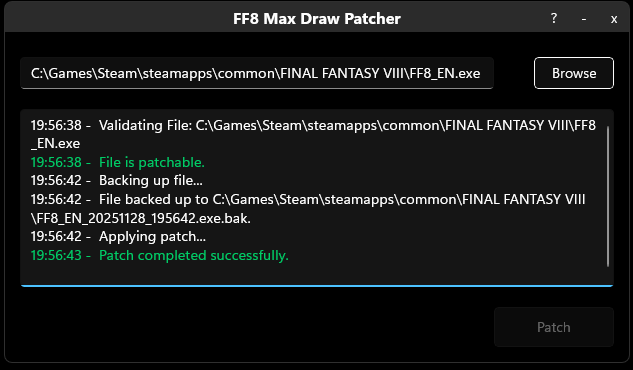
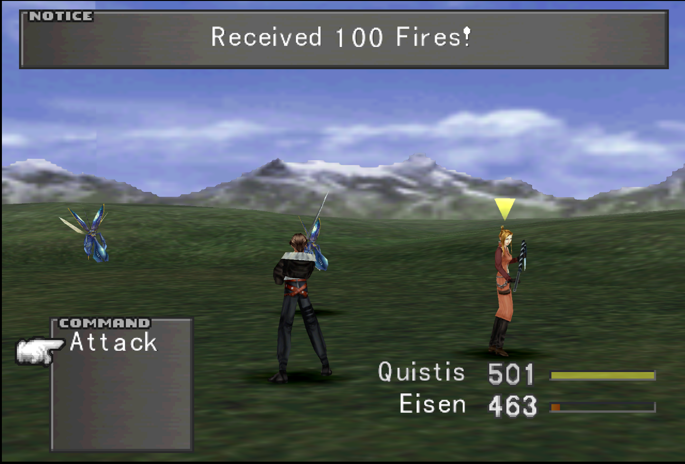
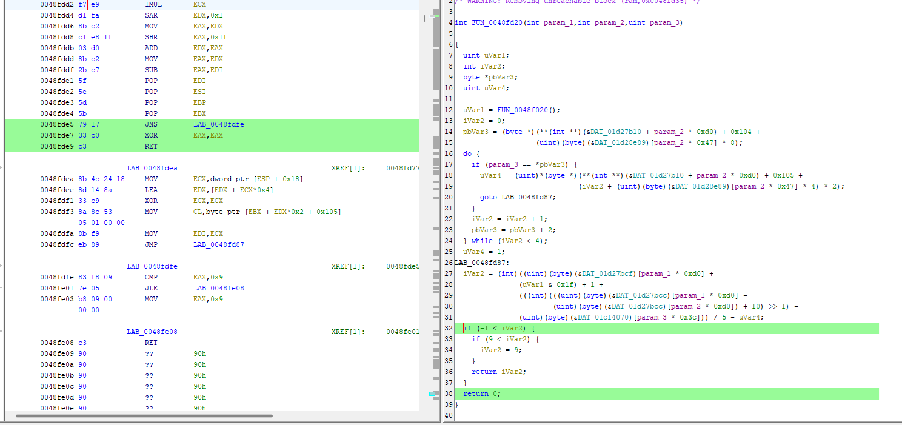
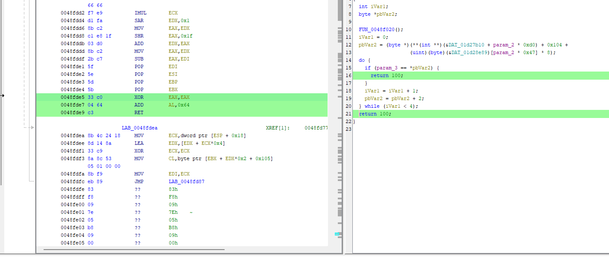

# FF8 Draw Max Patcher

An application to patch the original PC version of **Final Fantasy 8** (aka FF8 or FFVIII or Final Fantasy VIII) such that combat draws will always return 100 charges of the spell.

---

## Screenshots

  
*Main application interface.*

  
*Gameplay.*

---

## Requirements

- Windows 10 or newer
- Intel processor
- .NET 7 Runtime
- Original Final Fantasy 8 PC installation (NOT the remastered version)

---

## Patch instructions
1. Run the .exe file
2. Click **'Browse'** and select your FF8 application file (e.g. C:\Games\Steam\steamapps\common\FINAL FANTASY VIII\FF8_EN.exe)
3. Click the **'Patch'** button.
4. Run the patched exe file to play the game (or start through Steam or Gog).

---

## Unpatch instructions
1. Locate the backup file in the game folder (i.e. C:\Games\Steam\steamapps\common\FINAL FANTASY VIII\FF8_EN.exe.bak)
2. Delete the patched game file (i.e. FF8_EN.exe)
3. Rename the backup file. Make sure to change the extension back to exe.

---

## FAQ
**1. Why is this needed?**
- One of the most annoying aspects of this game is having to draw spells. You will want 100 charges of each spell per character but early game draws will only give you ~1-3 charges of a spell per draw. Now times that by ~50 different spells and 6 characters (not to mention having to refill spells after use). This patch makes it so that you get 100 charges per draw and won't have to waste hours  farming spells.

**2. Does this affect map draw points?**
- No, this only affects combat spell drawing.

**3. Does this interfere with drawing GFs?**
- No.

**4. Does this have any other affects?**
- None that I am aware of.

**5. What versions of the game does this work on?**
- This is only for the original version (not the remastered). I tested it on the Steam version but GOG, original cds, etc. should also work. It should also work on other language versions but I haven't tested it.

**6. Will this patch work on the ARM, Mac, and/or Linux versions of the game?**
- I've only tested it on the Windows x64 version. It likely works on Linux via Wine/Proton. It almost certaintly won't work on ARM or Mac.

**7. How does it work?**
- Surprisingly we only need to change 4 bytes of the game's code. A function calculates how many spells to draw, caps it between 0 and 9, and then returns the value. By making a small code change, we can instead just always return 100.

**8. Can I do this manually instead of using your application?**
- Yes. You will need a program that can edit hex like ImHex or Ghidra. The code to patch starts at address 0048FDE5 in Ghidra or 0008FDE5 in ImHex. You want to change bytes 79 17 33 C0 to 33 C0 04 64.

  
*Unpatched Code.*

  
*Patched Code.*